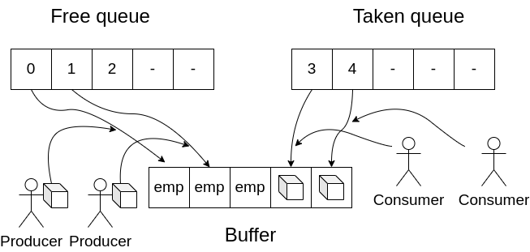

# Producers-consumers - a concurrent programming problem
This was a project for the Operating systems with concurrency programming course.
## Introduction
The producer-consumer problem is formulated as follows:

Producer:
- produces a number and puts it into the buffer
- waits for a consumer to consume the number

Consumer:
- consumes a product from the buffer
- waits for a producer to produce a number

Our goal is to implement a producer-consumer problem that supports multiple producers and consumers concurrently as shown in the following figure.

## Implementation
In the multi-producer-multi-consumer case, we use two queues, one for free positions and one for occupied positions. By using mutexes for each queue and a counting semaphore for the number of producers and consumers, we easily ensure mutual exclusion and synchronization, while making the cycle of producing and consuming numbers as short as possible.
